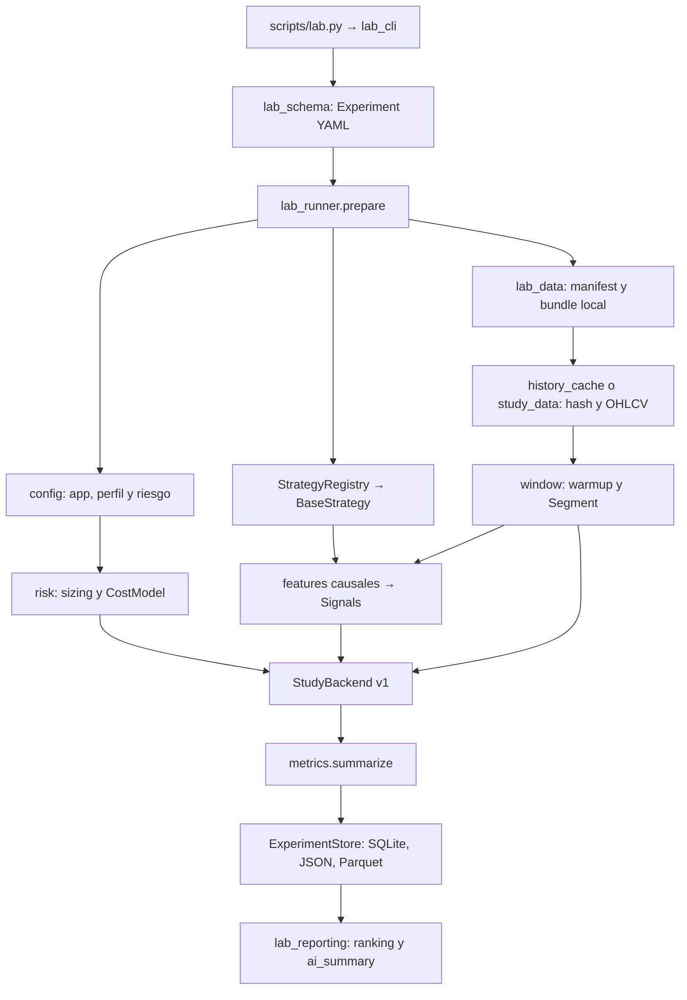

# Arquitectura técnica actual

Inspección: 2026-09-28. Paquete `quant-trading-lab` 0.1.0, Python >=3.12.
Rutas de módulos relativas a `src/quant_lab/`. El [audit anterior](lab-architecture-audit.md)
explica decisiones de reutilización; los protocolos históricos siguen vigentes para sus runners.

## Flujo ordinario

`scripts/lab.py` delega en `lab_cli.main`. `prepare(full=False)` valida el plan;
`prepare(full=True)` verifica también datos. `run` siempre usa FULL y ejecuta
serialmente combinaciones y escenarios. No llama a descargas ni modelos de IA.

## Configuración y registro

`config.py` contiene modelos Pydantic estrictos y `UniqueKeyLoader`. `lab_schema.py`
define mercados, grids, modos, ranking, filtros, train/validation/test, folds y stress.
Rechaza periodos incompatibles y campos desconocidos. El máximo de 100000 combinaciones
del schema es un límite técnico, no autorización para ejecutarlas con un agente.

`lab_runner.prepare` carga app y riesgo global, fusiona overrides de riesgo del perfil
y valida nombre, versión y `enabled`. Compone cada combinación con parámetros base
y rechaza duplicados resueltos. Capital/costes experimentales prevalecen sobre app.
Rutas experimentales son YAML-relative; referencias de app son app-relative.
`load_research_config` sigue disponible para los runners anteriores.

`strategies/registry.py` descubre clases `BaseStrategy` en módulos locales de confianza.
Falla ante imports inválidos o nombres duplicados; no aísla plugins externos.
El catálogo declara versión, estado, fecha explícita, timeframes, modos y adaptador.
`created_at=null` significa desconocido. `scaffolding.py` crea exclusivamente módulo,
YAML y test; no registra nombres en una lista central.

## Datos y features

`binance_history.py`, `csv_history.py`, `history.py`, `history_cache.py` gestionan
fuentes spot, requests y bundles. `candles.py` comprueba UTC, orden, duplicados,
huecos y OHLCV. `study_data.py` aporta auditoría y fingerprints por mercado;
`futures_data.py` y `mtf_data.py` atienden contratos, mark y funding.

`lab_data.py` admite `history_cache` y `study_data`: requiere `manifest.json`,
`candles.parquet`, identidad de mercado y directorio nombrado por dataset ID.
FAST verifica cobertura y huecos declarados; FULL añade SHA256, fingerprint y
validación de datos. Cada periodo incluyendo warmup debe ser continuo aunque el
bundle global tenga huecos. No se rellenan discontinuidades.

`features.py`, `indicators.py` ofrecen indicadores reutilizables. `multitimeframe.py`,
`mtf_clock.py`, `mtf_features.py`, `new_mtf_features.py` tratan agregación y disponibilidad
de velas completas. `prepare_features` conserva filas/orden; los cuatro métodos
producen un `bool` Python por fila. Los indicadores no ejecutan órdenes.

## Backend, riesgo y costes

`study_backend.py:StudyBackend v1` deriva de `reference_v3` en `backtest.py`, conservado
para historia, con duración explícita por vela. Recibe OHLCV, `Segment`, `Signals`,
distancias de stop y fracciones opcionales de sizing. Una posición colateralizada,
sin piramidación ni reversión en la misma apertura. Lab reinicia capital y liquida
al final de cada periodo. Warmup aporta contexto pero sus señales no abren posiciones
del periodo. Las decisiones al cierre se aplican como pronto a la siguiente apertura.

`risk.py` convierte porcentajes, redondea cantidad hacia abajo y aplica mínimos,
riesgo y exposición. Stop-risk incluye costes esperados del stop; fixed-notional
fija capital; volatility-target fija exposición a la entrada con información causal.
Lab restringe esta última a 1h por su anualización horaria. Stops habilitados en lab
son ATR. Targets, trailing y time stop proceden de `RiskConfig`.

`CostModel.price` desplaza precio en contra por `slippage_pct + spread_pct/2`;
comisión aplicada en ambos lados. `protective_fill` conserva reglas de gaps y
stop-first cuando stop y target coinciden intrabar. Trailing calculado al terminar
la vela entra en vigor en la siguiente. El timestamp intrabar desconocido no se inventa.

`perpetual_execution.py` implementa USD-M isolated 1x, mark, funding y liquidación
con supuestos explícitos. `mtf_execution.py`, `refinement_execution.py`,
`entry_timing_execution.py`, `structural_execution.py` y `batch_*_execution.py`
preservan adaptaciones especializadas. Lab rechaza adaptadores distintos de `ohlcv`;
no simula perpetuos usando silenciosamente el motor spot.

## Métricas y selección

`metrics.summarize` calcula retorno/CAGR, DD, PF, win rate, expectancy, exposición,
turnover, costes y Sharpe/Sortino/Calmar. Retornos diarios UTC, anualización sqrt(365),
tasa libre de riesgo cero. Valores indefinidos son null, incluido PF sin pérdidas.
Funding ordinario es null con nota spot/synthetic, no financiación histórica cero.

Lab ejecuta candidatos en train/validation/test y stress, ordenando por TRAIN/base.
Cada fold WF selecciona en TRAIN/base y ejecuta solo el elegido en TEST; se informa
separadamente del grid fijo. `lab_reporting.failure_reasons` genera PASS/FAIL según
filtros declarados. Supervivencia requiere aprobar periodos y escenarios ordinarios;
WF se informa aparte. Clasificaciones especializadas: [RESEARCH_RULES](RESEARCH_RULES.md).

## Persistencia y reproducción

`experiments.py:ExperimentStore` crea `<UTC>-<uuid>` con `exist_ok=False`, plan y
provenance. SQLite registra `started`, `completed`, `failed`, `skipped`, metadata,
error y SHA256 de `result.json` por backtest. JSON se crea exclusivamente y equity
se conserva en Parquet. Lab añade snapshot, resolved, environment, run/outcome
más los informes enumerados en [README](../README.md).

`provenance()` hashea Python en `src/`, `scripts/`, `tests/`, YAML en `configs/` y
`pyproject.toml`, incluyendo rutas/contenido. Guarda commit, estado Git, Python,
plataforma y versiones pandas/NumPy/PyArrow/Pydantic/PyYAML. Markdown y skills no
entran en ese `code_sha256`; sus cambios sí pueden aparecer en `git_status`.
Dataset fingerprint, hash del archivo y code hash son identidades diferentes.
El ID de configuración agrupa variantes; el ID de backtest identifica una ejecución.

`lab_reporting.runs/locate` lee metadata a dos niveles, solo `kind=lab_experiment_v1`.
`report` no reconstruye informes ni interpreta historia legacy como lab. Sin outcome:
`INCOMPLETE (running or interrupted)`. Fallos preservan evidencia; lab no tiene resume
genérico. Estudios especializados conservan snapshots, recibos y manifests propios.

## Entrypoints y tests

Forward aislado: `forward/runner.py` → `market_data/okx.py` (REST/WS demo) →
`forward/strategy.py` (estrategia original) → riesgo existente → SignalOnlyBroker →
`forward/store.py` (SQLite/eventos/checkpoint e informes). `brokers/okx_demo.py` solo
acepta GET de una allowlist; las mutaciones lanzan TradingDisabled. No cambia el
backend histórico. Contratos, causalidad, recuperación y límites del estado shadow:
[forward-signal-only](forward-signal-only.md).

Scripts download/import preparan fuentes explícitamente. `run_backtest.py` usa el
motor de referencia; `run_batch*.py`, `run_cross_market_study.py`, `run_mtf_series.py`,
`run_execution_refinement.py`, `run_new_mtf_strategies.py`, `run_entry_timing_15m.py`
coordinan estudios independientes. `preflight_*`, `verify_*`, `report_batch_*`,
`plot_batch.py`, `classify_new_mtf_results.py` tienen contratos diferentes: revisar
su protocolo y argumentos antes de invocarlos.

Unit tests cubren schemas, registro, estrategias, reloj MTF y clasificación;
regresiones cubren indicadores, causalidad y fills. Integración usa CLI real,
scaffolds en checkouts temporales, CSV y reporting sintético. No hace falta repetir
miles de backtests históricos para comprobar documentación.
